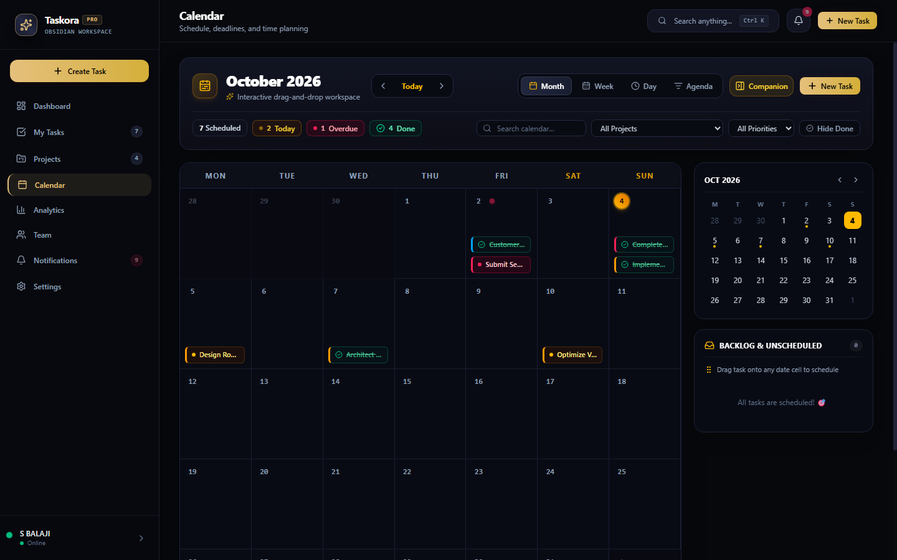
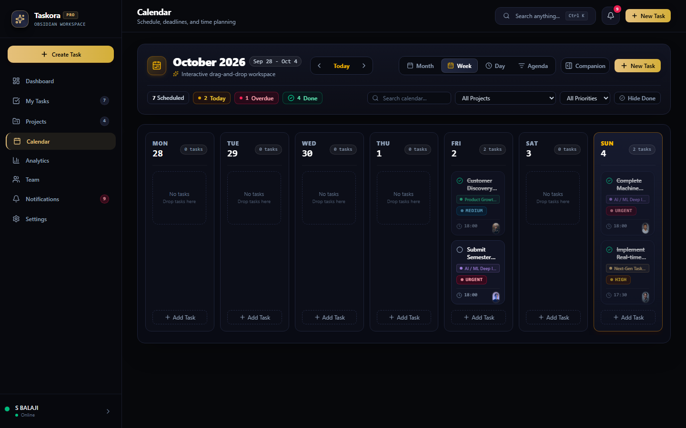
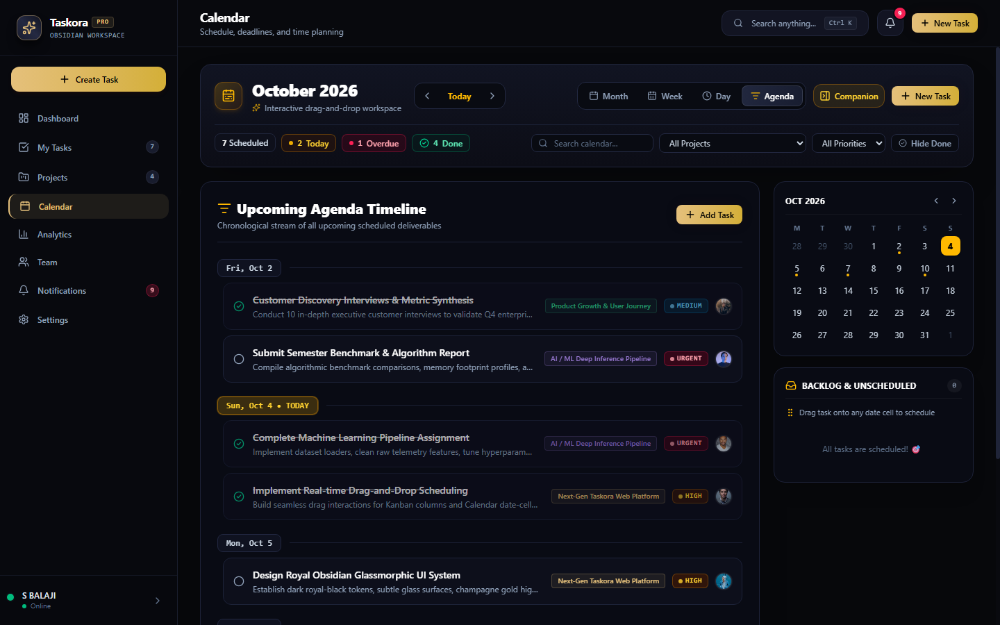
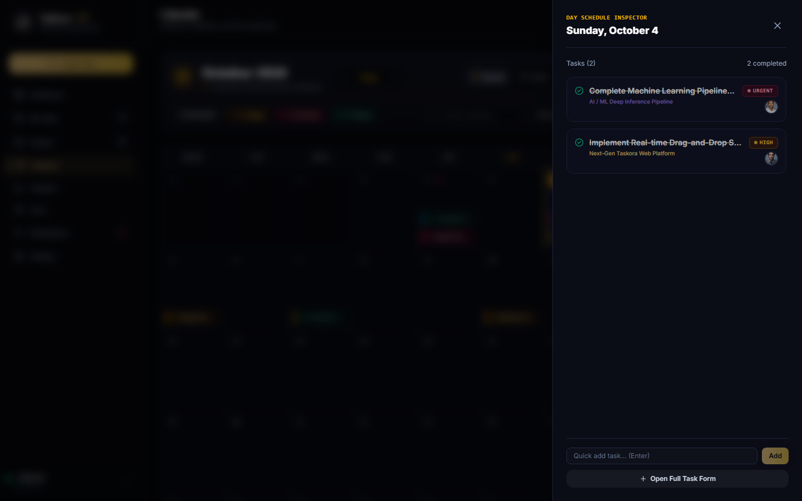

# Taskora — Obsidian Royal Productivity Workspace

<div align="center">


### Premium Dark Royal-Black Task & Project Management System

*Obsidian Black · Charcoal Surfaces · Champagne Gold Accents · Electric Purple Highlights*

[](https://react.dev)
[](https://www.typescriptlang.org/)
[](https://vitejs.dev/)
[](https://tailwindcss.com/)
[](https://expressjs.com/)
[](LICENSE)

</div>

---

## 📸 Screenshots

| Month Grid Workspace | Week Schedule View |
| :---: | :---: |
|  |  |

| Upcoming Agenda Timeline | Day Schedule Inspector |
| :---: | :---: |
|  |  |

---

## 🌟 Key Features

### 1. 🎨 Obsidian Royal Aesthetic
- **Color Palette**: Deep Obsidian Black (`#07080B`), Charcoal cards (`#131622`), borders (`#1C2136`).
- **Accents**: Champagne Gold (`#E5C07B`) & Electric Royal Purple (`#9D7CD8`).
- **Theme Customizer**: Live switching between Champagne Gold, Electric Purple, Emerald Glow, and Cyan Spark.
- **Layout Density**: Instant toggle between *Comfortable* and *Compact* spacing.
- **Micro-Interactions**: Smooth glassmorphism, confetti celebration animations upon completion, glowing hover halos.

### 2. 📊 Executive Dashboard
- Dynamic time-aware greeting (*"Good morning / afternoon / evening, [User Name]"*).
- **5 Real-time Stat Cards**: Total Tasks, Completed, In Progress, Pending (To Do + Review), Overdue.
- **Live Productivity Score Ring (0–100)**: Dynamically computed efficiency score with motivational feedback.
- **Today's Tasks Checklist**: Fast checkbox completion with sound celebration and instant stats recalculation.

### 3. 📋 Task Management (My Tasks)
- **Kanban Board with Native HTML5 Drag-and-Drop**: Real drag between *To Do*, *In Progress*, *Review*, and *Completed* columns with server persistence.
- **Table / List View**: Clean spreadsheet-style view with sorting by due date, priority, status, and title.
- **Multi-Filter System**: Filter simultaneously by Project, Priority, Status, Assignee, and Tags.
- **Task Priorities**: Subtle non-overwhelming indicators for `Low`, `Medium`, `High`, and `Urgent`.

### 4. 🗓️ Advanced Calendar System
- **4 Dedicated Views**:
  - **Month View**: 7-day grid with today's golden glowing halo, overdue badges, priority stripes, and click-to-inspect.
  - **Week View**: Spacious 7-column planner with two-line titles, project tags, priority pills, and time indicators.
  - **Day View**: Single-day focus workspace with quick inline task creation.
  - **Agenda Timeline**: Chronological deliverable stream grouped into Overdue, Today, Tomorrow, and Upcoming.
- **Companion Sidebar**: Compact Mini-Calendar month picker + Unscheduled Backlog tray.
- **Drag-and-Drop Scheduling**: Drag tasks directly from the Unscheduled Tray onto any date to reschedule.
- **Day Schedule Inspector Drawer**: Slide-out panel for any date with quick checkbox toggling and inline task adding.

### 5. 📁 Projects Workspace
- Project cards with real progress bars, deadline countdowns, and member avatars.
- Project Detail page with project-scoped Kanban boards, task lists, and collaborator directory.
- Full project CRUD operations with confirmation dialogs.

### 6. 👥 Team & Collaboration
- Directory of team members with avatars, roles, departments, online status indicators, and live workload telemetry.
- Task assignments and mention capabilities.

### 7. 🔍 Spotlight Global Search (Ctrl + K / Cmd + K)
- Blazing fast fuzzy search across tasks, projects, team members, and discussion comments.

### 8. 💬 Comments, Subtasks & Activity History
- Detailed slide-out panel for every task:
  - Subtask checklists with progress percentage.
  - Threaded comment discussions with user avatars and timestamps.
  - Visual activity audit history timeline.

---

## 🛠️ Technology Stack

- **Frontend**: React 19, TypeScript, Vite 8, Tailwind CSS v4, Lucide React, Canvas Confetti
- **Backend**: Node.js, Express 5 REST API
- **Persistence**: Atomic JSON storage engine (`server/db.json`) with safe recovery
- **Multi-Port Engine**: Dual listeners on ports `5001` and `3000` with host `0.0.0.0` for full Windows network compatibility.

---

## 🚀 Getting Started

### Prerequisites
- Node.js (v18 or higher)
- npm or yarn

### Installation
```bash
# Clone the repository
git clone https://github.com/SRINIVASULA-BALAJI/TASKORA.git
cd TASKORA

# Install dependencies
npm install
```

### Running the Application

#### Option A: Production Mode (Recommended)
Builds client assets and runs the unified Express server:
```bash
npm run build
npm start
```
Open **[http://localhost:3000](http://localhost:3000)** or **[http://localhost:5001](http://localhost:5001)** in your browser.

#### Option B: Development Mode
Runs both the backend API and the Vite hot-reloading dev server concurrently:
```bash
npm run dev
```
Open **[http://localhost:5173](http://localhost:5173)** in your browser.

---

## 📄 License
This project is licensed under the MIT License - see the [LICENSE](LICENSE) file for details.
